<!-- ════════════════════════════════════════════════════════════════════════ -->
<!-- ░░  IROENNYS · GALAXY PROFILE  ·  v3.0                                ░░ -->
<!-- ════════════════════════════════════════════════════════════════════════ -->

<!-- ◆ HEADER NEBULA ◆ -->

 

<!-- ◆ AVATAR ORBITING A PURPLE NEBULA (custom SVG, fully animated) ◆ -->

  

<!-- ◆ NAME (typing) ◆ -->

<!-- ◆ SUBTITLE (rotating cosmic quotes) ◆ -->

  

<!-- ◆ STATUS PILLS ◆ -->

&nbsp;

&nbsp;

  

<!-- ◆ CONSTELLATION CONNECTING ITSELF (custom SVG) ◆ -->

  

<!-- ◆ DIVIDER (sliding glow blob) ◆ -->

 

<!-- ════════════════════════════════════════════════════════════════════════ -->
<!-- ░░  HEARTBEAT                                                          ░░ -->
<!-- ════════════════════════════════════════════════════════════════════════ -->

  

<!-- ◆ COSMIC STATS / FAUX TELEMETRY (typing) ◆ -->

  

<!-- ◆ DIVIDER ◆ -->

 

<!-- ════════════════════════════════════════════════════════════════════════ -->
<!-- ░░  CONTRIBUTION SNAKE (lives in `output` branch — purely visual)      ░░ -->
<!-- ════════════════════════════════════════════════════════════════════════ -->

<picture>
  <source media="(prefers-color-scheme: dark)"
          srcset="https://raw.githubusercontent.com/iroennys-admin/iroennys-admin/output/github-snake-dark.svg" />
  <source media="(prefers-color-scheme: light)"
          srcset="https://raw.githubusercontent.com/iroennys-admin/iroennys-admin/output/github-snake.svg" />
  
</picture>

  

<!-- ◆ DIVIDER ◆ -->

 

<!-- ════════════════════════════════════════════════════════════════════════ -->
<!-- ░░  SIGNALS (social links as cosmic transmissions)                     ░░ -->
<!-- ════════════════════════════════════════════════════════════════════════ -->

### ◇&nbsp;&nbsp;transmit a signal

&nbsp;

&nbsp;

  

<!-- ════════════════════════════════════════════════════════════════════════ -->
<!-- ░░  COMET FOOTER                                                       ░░ -->
<!-- ════════════════════════════════════════════════════════════════════════ -->

<!-- ◆ FOOTER WAVE ◆ -->

<!-- ◆ FAREWELL ◆ -->

<!--
  ─────────────────────────────────────────────────────────────────────────
  All animations are pure SVG (SMIL) + a few generator services.
  No projects, no stats, no language breakdown — just cosmic vibes.
  Custom SVGs live in /assets and render directly from this repo.
  ─────────────────────────────────────────────────────────────────────────
-->
